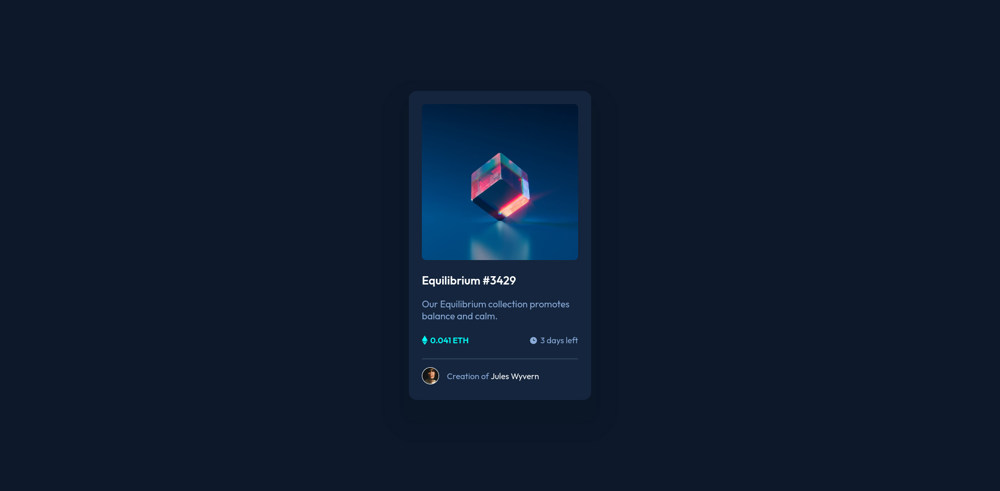
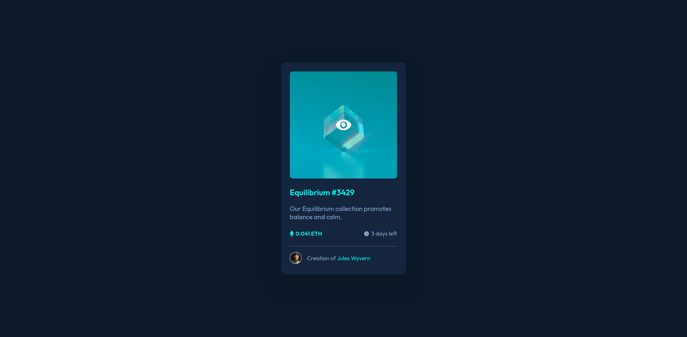
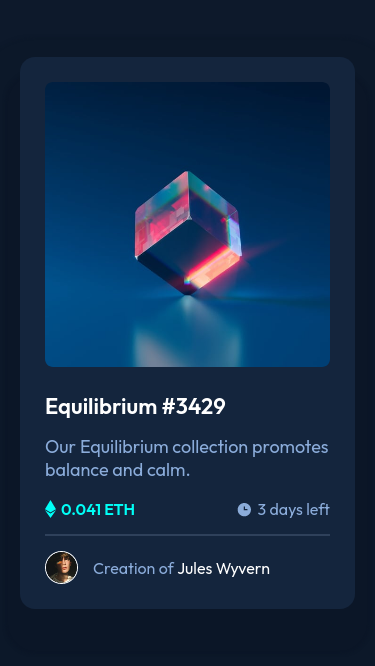

# Frontend Mentor - NFT preview card component solution

This is a solution to the [NFT preview card component challenge on Frontend Mentor](https://www.frontendmentor.io/challenges/nft-preview-card-component-SbdUL_w0U). Frontend Mentor challenges help you improve your coding skills by building realistic projects. 

## The challenge

The challenge is to build out this preview card component and get it looking as close to the design as possible.

Users should be able to:

- View the optimal layout depending on their device's screen size
- See hover states for interactive elements

## Solution

### Links

- Solution URL: [https://github.com/julianoboese/nft-preview-card-component](ttps://github.com/julianoboese/nft-preview-card-component)
- Live Site URL: [https://julianoboese.github.io/nft-preview-card-component](https://julianoboese.github.io/nft-preview-card-component)
